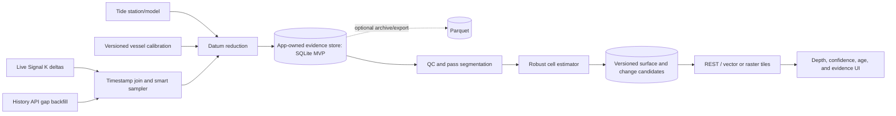

# Signal K Bathymetry: concept and technical specification

Status: implemented MVP / evolving specification

Date: 2026-08-24

## 1. Product statement

Build a local bathymetric map from the vessel's ordinary Signal K data. The app
records position and depth while the vessel is moving, reduces each sounding to
an explicitly named vertical datum using the tide at the observation time, and
combines repeat passes into a depth surface with visible uncertainty,
confidence, age, and change history.

The primary evidence store is the app's own high-resolution, synchronized log.
The storage format is an implementation choice: SQLite is the recommended MVP
operational store, while Parquet is an optional compact archive/export. The
Signal K History API is a fallback for backfill and recovery, not the preferred
source for new data. This preserves synchronized inputs, `$source`, calibration,
and tide provenance that can be lost when a history provider aggregates paths.

The result is useful for personal reconnaissance, identifying where another
pass is valuable, and detecting likely change. It must never claim hydrographic
survey quality or replace official charts.

## 2. Goals and non-goals

### Goals

- Record one coherent sounding from depth, position, vessel geometry, tide,
  timestamp, and source metadata.
- Prefer `environment.depth.belowKeel`, while safely supporting below-surface
  and below-transducer inputs.
- Convert every usable sounding to depth below one explicit target datum, such
  as MLLW or LAT.
- Preserve raw evidence so every surface cell can be reproduced after changing
  calibration or algorithms.
- Reject obvious sensor failures without treating repeated, consistent new
  depths as permanent outliers.
- Represent estimated depth, uncertainty, confidence, coverage, data age, and
  possible seabed change as different concepts.
- Run offline on typical Signal K hardware and degrade cleanly when tide or
  historical data is unavailable.

### Non-goals

- Certification to IHO S-44 or suitability for primary navigation.
- Inferring a vertical datum from station name, country, or the generic Signal K
  tide path.
- Filling unsurveyed water with plausible-looking interpolation.
- Permanently deleting raw observations.
- Treating sample count from one slow pass as equivalent to independent repeat
  surveys.

## 3. The key datum calculation

Depth is positive downward. Water level is positive upward from the target
datum.

For a below-keel observation:

```text
depth_below_datum = below_keel + surface_to_keel - water_level_above_datum
```

Equivalent forms are:

```text
depth_below_datum = below_surface - water_level_above_datum
depth_below_datum = below_transducer + surface_to_transducer
                    - water_level_above_datum
```

Example: 3.2 m below keel, 1.5 m from waterline to keel, and a tide 0.8 m
above MLLW gives `3.2 + 1.5 - 0.8 = 3.9 m below MLLW`.

"Zero datum" is not globally universal. NOAA products commonly use MLLW while
other authorities may use LAT or another chart datum. The app therefore stores
the datum identifier on every reduced sounding and never combines unlike or
unknown datums. The UI says **Depth below MLLW**, for example, rather than
**actual depth**.

### Depth input priority

1. `environment.depth.belowTransducer` plus a versioned, measured
   `surfaceToTransducer` calibration is the most direct instrument model.
2. `environment.depth.belowSurface` may be used when its derivation and source
   are known.
3. `environment.depth.belowKeel` plus a versioned, measured
   `surfaceToKeel` value satisfies the initial use case.

`design.draft.maximum` is not a good silent substitute for the actual
waterline-to-keel distance. Loading, ballast, squat, heel, and lifting-keel
state can change the effective value. If it is used as a configured fallback,
the app marks it as such and assigns additional uncertainty.

The app must detect when multiple depth paths are derived from the same sensor;
they are alternatives, not independent votes.

## 4. Inputs and provenance

### Required for a usable sounding

| Input | Signal K source | Rule |
| --- | --- | --- |
| Position | `navigation.position` | WGS84 latitude/longitude and observation timestamp |
| Depth | `environment.depth.belowKeel`, `.belowSurface`, or `.belowTransducer` | SI meters; one configured source/reference wins |
| Vertical offset | Calibration profile and/or Signal K depth offsets | Must state which reference points it connects |
| Water level | Historical tide value or tide model evaluated at sounding time | Datum, station/model, timestamp, and method are mandatory |
| Provenance | Delta `$source`, context, history provider, calibration version | `unknown` is retained, never invented |

### Useful quality inputs

- `navigation.speedOverGround` and course for stationary filtering, along-track
  checks, and pass separation.
- Signal K GNSS quality values when available.
- `environment.heave`, attitude, and vessel speed for later heave, lever-arm,
  heel, and squat corrections.
- Water temperature/salinity or sounder calibration for sound-speed uncertainty.
- Tide station name, id, location, source, datum, and whether the water level is
  observed or predicted.
- A stable vessel, transducer, and calibration-profile identifier.

Missing optional values increase uncertainty; they do not acquire fictional
defaults without being shown in configuration and provenance.

## 5. Tide and station behavior

Time of day is not an independent depth correction. The UTC observation time is
used to evaluate a tide prediction or select an observed water level at that
instant.

Station selection follows this order:

1. A manually pinned station/model and datum.
2. A tide provider's position-aware default.
3. The nearest compatible station returned by the provider.

Geographic distance alone is insufficient: a close station across a headland
or tidal barrier may be worse than a farther station in the same tidal regime.
The app records station distance but relies on provider topology/model knowledge
where available. It warns or refuses reduction beyond a configurable validity
radius.

The current Signal K tide paths include `environment.tide.heightNow`; tide
plugins may additionally expose `stationName` and a Tides API with station and
datum details. A bare `heightNow` is usable only when the user explicitly
configures its datum and whether it is observed or predicted. A provider
response that explicitly identifies `datum: "MLLW"` must not be relabeled LAT
because an older generic path description says LAT.

For the live logger, the app snapshots the latest tide value and provenance if
it is within its TTL, or evaluates the configured harmonic/model provider at
the sounding timestamp. For history backfill it should prefer reconstructing
the tide from the same station/model at the historical timestamp. Historical
`environment.tide.heightNow` is the fallback only when its station and datum can
be established.

## 6. Capture and storage

### 6.1 Smart live sampler

The sampler subscribes to the chosen depth source and maintains a short
timestamped buffer of position, tide, speed, course, and quality values. It
forms a sounding only when inputs are within configured time-skew limits.

The default hybrid policy is:

- first apply a stationary gate;
- while underway, record when either one second has elapsed or the transducer
  has moved `N` meters since the last record;
- always require a fresh depth event; and
- open a new track segment after a source/calibration change or a long gap.

Suggested starting values, to be tuned with real data:

```yaml
sampling:
  maxIntervalSeconds: 1
  distanceMeters: 2
  minSpeedMetersPerSecond: 0.25
  stationaryRadiusMeters: 3
  maxLiveTimeSkewSeconds: 2
```

The stationary gate combines SOG and displacement so GPS jitter at anchor does
not paint one cell with thousands of nominally independent samples. While
stationary, raw pings are reduced into robust 60-second windows. Each persisted
window retains accepted and rejected sample counts, median depth, robust spread,
and start/end time. Isolated strange readings are excluded from the window
estimate but remain visible in its rejected count.

Repeated stationary windows are useful evidence, but adjacent samples are
correlated. Only the random sounder component receives a capped square-root
precision improvement (using a nominal 10-second decorrelation interval).
Agreement among additional windows improves within-visit repeatability with
diminishing weight. Separate visits, days, headings, or sources remain the
stronger evidence for regime confirmation, so a night at anchor cannot silently
claim the same survey diversity as several return passes.

At high speed the distance trigger can fire before one second if the sensors
actually update that quickly. At low speed the time trigger maintains track
continuity. Configuration may instead select strictly time-based or strictly
distance-based sampling.

### 6.2 Logical evidence schema

Evidence rows are flat and schema-versioned for long-term compatibility,
regardless of physical backend. The authoritative columns include:

```text
schema_version, sounding_id, observed_at_utc, ingested_at_utc
context, vessel_id, track_id, pass_id, origin                 # live | history
latitude_deg, longitude_deg, position_source, horizontal_sigma_m
depth_raw_m, depth_reference, depth_source
surface_to_keel_m, surface_to_transducer_m, calibration_id
tide_height_m, tide_datum, tide_station_id, tide_station_name
tide_station_latitude_deg, tide_station_longitude_deg
tide_method, tide_source, tide_observed_at_utc, tide_sigma_m
datum_depth_m, vertical_sigma_m, reduction_model_version
sog_mps, cog_true_rad, heave_m, input_time_skew_ms
qc_state, qc_reason_mask, extras_json
```

Raw depth and all reduction inputs remain present even when a cached
`datum_depth_m` is stored. Reprocessing writes a new derived surface/version;
it does not mutate the evidence to match a new algorithm.

### 6.3 Recommended operational store: SQLite

Parquet is not required to satisfy the product. For one vessel, SQLite is the
recommended primary store because it provides transactions, uniqueness
constraints, incremental inserts, indexed time/bounding-box lookups, and simple
backup without a compaction/query engine.

At an absolute 1 Hz around the clock the upper bound is about 31.5 million rows
per year; normal underway-only use is much less. This warrants batching and
indexes, but does not by itself require a columnar store.

Use a single app-owned database conceptually organized as:

```sql
raw_soundings         -- append-only observations and reduction inputs
qc_classifications    -- model-versioned state/reasons; raw rows are not updated
passes                -- independent-pass segmentation
surface_versions      -- reproducibility manifest
surface_cells         -- current and historical cell regimes
calibrations          -- versioned offsets and uncertainty assumptions
tide_models           -- station/model/datum provenance
ingestion_coverage    -- live/history intervals and gaps
```

Enable WAL mode, use prepared statements, and insert short batches in
transactions rather than committing every sounding. A uniqueness constraint or
ingestion fingerprint handles live/history deduplication. Index observation
time, pass, source, and surface version. Use SQLite R*Tree for bounding-box
lookup when the runtime build includes it; otherwise index a hierarchical cell
id alongside WGS84 coordinates.

Treat `raw_soundings` as immutable at the application layer and, if practical,
with defensive database triggers. QC and new reduction results go into
model-versioned tables. A database transaction commits the raw row and its
coverage cursor together, so a crash cannot claim an interval was ingested when
its evidence was not stored.

The plugin should prefer a Signal K server-managed plugin database API if that
API is available and meets the spatial/backup requirements. Otherwise use an
SQLite implementation supported by the minimum Node runtime. The built-in
`node:sqlite` avoids shipping a separate native dependency on supported Node
versions, but its exact stability and enabled SQLite extensions must be checked
against the Signal K release matrix.

### 6.4 Optional Parquet archive and export

Parquet becomes valuable when the user wants compact multi-year archives, fast
bulk scans, transfer to another analytics system, or crowdsourced-data export.
It is not a good live state store for dedupe, QC reclassification, and individual
cell inspection because immutable files require staging, manifests, and
compaction.

If enabled, export completed SQLite time ranges to date-based Hive partitions:

```text
archive/schema=1/vessel=<id>/date=2026-08-24/part-<uuid>.parquet
archive/manifests/coverage.json
```

Write to a temporary file and atomically rename. The archive manifest holds file
checksums, source database range, bounding box, row count, schema version, and
export model. Do not remove source SQLite rows in the MVP. A future retention
policy may prune them only after archive verification and a tested restore path.

#### Recommended Parquet compression profile

Parquet separates **encoding** from **compression**. Encoding first turns a
column into a more compressible representation; a codec then compresses each
page. This supports a ClickHouse-like `Delta + ZSTD` strategy without running
ClickHouse:

| Data | Physical representation | Parquet encoding | Compression |
| --- | --- | --- | --- |
| UTC timestamp | `INT64` microseconds | `DELTA_BINARY_PACKED` | ZSTD |
| Latitude/longitude | `INT32` scaled degrees, preferably `e7` | `DELTA_BINARY_PACKED` | ZSTD |
| Depth, tide, offsets, uncertainty | `INT32` millimeters / logical decimal | `DELTA_BINARY_PACKED` | ZSTD |
| SOG and other smoothly changing numerics | Scaled `INT32` where practical | `DELTA_BINARY_PACKED` | ZSTD |
| Floating values retained as float/double | `FLOAT` / `DOUBLE` | `BYTE_STREAM_SPLIT` | ZSTD |
| Source, station, datum, state, reason | String/enum | `RLE_DICTIONARY` | ZSTD |
| Boolean and null runs | Boolean/definition levels | RLE/bit packing | ZSTD |
| High-cardinality JSON or text | Byte array | Delta-length/plain as supported | ZSTD |

Store rows in observation-time order within a vessel/track partition. At one
second or a few meters per sample, consecutive timestamps, coordinates, and
depths have small deltas, which is exactly the input delta-binary packing is
designed for. Latitude and longitude at `1e-7` degrees retain roughly centimeter
resolution, already finer than the expected GNSS/transducer footprint. Depth in
integer millimeters is also finer than the real sensor accuracy. Quantization is
part of the declared schema and never changes silently.

Start with ZSTD level 3; test levels 1 and 3 on the minimum Raspberry Pi/Venus
hardware and use level 1 if write CPU or power is material. Snappy is the
compatibility/faster-write fallback, at the cost of larger files. Avoid high
ZSTD levels for live compaction unless measurements demonstrate a useful gain.

Use Parquet data-page/writer version 2 and per-column encoding only if the chosen
writer and all required readers support them. Not every JavaScript Parquet
library exposes `DELTA_BINARY_PACKED` or `BYTE_STREAM_SPLIT`; writer capability
is an implementation-selection gate. If delta encoding is unavailable, scaled
integers plus ZSTD still compress well and preserve a migration path.

Daily export should produce roughly one or a few files with tens of thousands
of chronological rows and useful row-group/page statistics. Do not permanently
retain 5-minute Parquet files: their footer and dictionary overhead and small
pages reduce compression and scan performance.

Avoid a random UUID in every row. Identify a sounding by `(file_id, row_index)`
or a delta-friendly sequence number, and calculate a stable content hash only
when an external identifier is needed. Move repeated calibration and tide-model
documents into versioned metadata tables referenced by compact ids. Keep
`extras_json` null in ordinary rows so diagnostic payloads do not dominate the
core sounding columns.

Before fixing defaults, benchmark a representative 24-hour underway capture
and report bytes per accepted sounding, encode/decode throughput, peak memory,
CPU time, and file size for at least:

1. scaled integer + delta-binary-packed + ZSTD 1;
2. scaled integer + delta-binary-packed + ZSTD 3;
3. scaled integer + ZSTD 3 without explicit delta; and
4. floating point + byte-stream-split + ZSTD 3.

Derived map tiles are disposable caches. The SQLite evidence database,
versioned calibration/tide metadata, and any verified Parquet archive are the
backup-critical assets.

### 6.5 History API fallback

On startup and on request, compare the manifest with the desired time range and
backfill uncovered intervals from:

```text
GET /signalk/v2/api/history/paths
GET /signalk/v2/api/history/_providers
GET /signalk/v2/api/history/values
```

Query short UTC windows at no coarser than one-second resolution for position,
the selected depth path, tide, SOG, and optional quality paths. Join values by
nearest timestamp within a stricter configured tolerance; never assume two
values are synchronous merely because a provider put them in the same broad
aggregation bucket.

The standard History API returns time-aligned columns but source identity is not
portable across providers. Backfilled rows therefore carry `origin=history`,
the provider id, reported resolution/aggregation, and `source=unknown` when
necessary, with a confidence penalty. Provider-specific source filtering may be
used as an optional adapter, not a correctness dependency.

Deduplicate live and history rows by time, position, selected depth source, and
raw value within tolerances. Keep the live row because it has richer provenance;
record the duplicate relationship rather than deleting unexplained conflicts.

## 7. Processing pipeline



Stages are deterministic for a declared model version. A surface build records
the input file checksums, calibration ids, tide model/station data version,
configuration, and code version.

## 8. Quality control and outliers

### 8.1 Never erase evidence

Each sounding moves among `pending`, `accepted`, `quarantined`, and `rejected`
for a particular model version. Raw evidence is immutable. A later model can
reclassify it, and the UI can inspect the reason mask.

### 8.2 Hard validation

Quarantine observations with invalid coordinates/timestamps, non-finite or
out-of-instrument-range depths, stale position/tide, unknown datum, excessive
input time skew, or known sounder no-return/max-range sentinel behavior.
Instrument range belongs in the calibration profile; a universal ocean-depth
cutoff would be wrong.

### 8.3 Track-local checks

- A Hampel-style rolling median/MAD filter identifies isolated depth spikes.
- Depth slope is evaluated per meter traveled, not only per second.
- Repeated identical maximum readings, sudden zeroes, and jumps paired with
  source changes receive explicit reason codes.
- An observation is initially quarantined, not rejected, when it disagrees with
  both its along-track neighborhood and nearby cells by more than
  `max(k * robust_sigma, absolute_floor)`.

Suggested starting values are `k=4.5` and `absolute_floor=0.5 m`; both are
configuration, not hydrographic standards.

### 8.4 Independent passes, not point votes

Samples are grouped into passes using time gaps, track direction, and voyage/day.
Dense samples from a single pass first produce one robust pass estimate per
cell. Surface estimation then combines pass estimates, preventing a slow pass
from outvoting three independent revisits.

Use a weighted median for initialization and a Huber robust estimator for the
cell depth. Weight inputs by their vertical/horizontal uncertainty, tide quality,
time synchronization, source/calibration quality, and recency. A local plane may
be fitted when there is enough surrounding coverage; do not smooth across a
shoreline, channel edge, or unsampled gap.

### 8.5 Repeated disagreement means possible change

A new cluster that disagrees with the established cell is a **change
candidate**, not an endlessly rejected outlier. Promote a new seabed regime
when, by default:

- at least three independent passes support it;
- observations span at least two days or another configured independence test;
- the difference exceeds the combined uncertainty and an absolute floor; and
- a strong majority of recent pass estimates support the new cluster.

Keep the old regime with its date range. Mark the cell `changing` until the new
regime has adequate coverage. Credible shoaling is safety-asymmetric: show a
provisional shallow hazard immediately with low confidence. Claimed deepening
requires full confirmation before it changes the conservative map surface.

This handles dredging, silting, moving sandbars, vegetation, calibration
changes, and sensor failures without confusing them with one another.

## 9. Uncertainty, confidence, and recency

### 9.1 Uncertainty is in meters

Maintain horizontal and vertical uncertainty separately. A starting vertical
error budget is:

```text
sigma_vertical = sqrt(
  sigma_depth^2 + sigma_offset^2 + sigma_tide^2 + sigma_heave^2
  + sigma_sound_speed^2 + sigma_time_alignment^2
)
```

Horizontal uncertainty includes GNSS, antenna-to-transducer lever arm, attitude,
and distance traveled during timestamp error. Unknown components use declared,
conservative calibration defaults and are shown as estimated.

For navigation-oriented coloring, calculate a conservative shallow estimate:

```text
depth_conservative = robust_depth - 1.645 * total_cell_sigma
```

This is a one-sided 95% lower bound only when the uncertainty assumptions are
credible. Low-quality cells should be labeled low confidence rather than
offering false probabilistic precision.

### 9.2 Confidence is a transparent score

Confidence is a 0–1 fitness score, not another unit for uncertainty. Expose its
components:

- input quality and completeness;
- repeatability within independent passes;
- number and independence of passes/sources;
- spatial support and distance to the nearest accepted sounding;
- tide/station/datum quality;
- recency; and
- regime stability.

Combine components with a weighted geometric mean so one weak dimension cannot
be hidden by several strong ones. Initial labels are high `>= 0.80`, medium
`>= 0.55`, and low below that; retain the numeric components for audit and
tuning.

### 9.3 Age never deletes data

Use a per-cell recency factor:

```text
recency = 2 ^ (-age / half_life)
```

Suggested default half-lives are starting policy values:

| Environment | Half-life |
| --- | ---: |
| River bar, dredged channel, mobile inlet | 90 days |
| Harbor or estuary | 180 days |
| General coastal bottom / unknown | 1 year |
| Stable rock or deep ocean | 5 years |

The newest accepted observation, oldest supporting observation, epoch span, and
half-life class are all visible. Aging reduces confidence and model weight; it
does not manufacture a depth trend or delete history. A cell can be old but
internally consistent, or recent but unstable—those should look different.

## 10. Spatial surface and visual language

### 10.1 Surface construction

Start with configurable 5 m metric cells for nearshore use and coarser cells
offshore. Store WGS84 observations and derive a hierarchical tile/cell id for
rendering. Later, adapt cell size to sensor footprint, horizontal uncertainty,
depth, and sample density.

Every cell contains at least:

```text
cell_id, datum, robust_depth_m, conservative_depth_m
vertical_sigma_m, horizontal_sigma_m, confidence
accepted_pass_count, source_count, sounding_count
oldest_at, newest_at, half_life_class
regime_id, change_state, surface_version
nearest_observation_distance_m
```

No-data remains transparent/hatched. Interpolation is limited to a declared
maximum distance from accepted observations and never crosses known land.

### 10.2 Color and confidence

The chart-datum fill uses `conservative_depth_m`, not the mean. Its configured
danger boundary is the required water column at zero tide:
`surface_to_keel_m + danger_under_keel_m`. The tide-adjusted fill instead uses
conservative projected under-keel clearance directly:

- very shallow / below configured safety depth: warm yellow-orange-red;
- moderate depth: cyan to medium blue;
- deep water: dark blue;
- dry or negative datum depth: land/tan treatment; and
- no data: no fill.

Use perceptually ordered, color-vision-deficiency-aware colors and labeled
contours. The `dangerUnderKeelM` plugin setting defaults to 0.75 m and is
labeled as clearance rather than total depth. In chart-datum mode the UI must
say that the safety coloring is the zero-tide reference; only
tide-adjusted-now mode claims to represent current projected clearance.

Do not encode confidence only as transparency; that can look like deeper or
missing water. Use a second visual channel:

- high confidence: clean fill;
- medium: sparse dots;
- low: crosshatch/gray stipple;
- changing: magenta outline or pulse in interactive view;
- stale: calendar/age overlay, with an optional age-only layer.

Tapping a cell opens an evidence card with depth estimate and conservative
depth, datum, uncertainty, confidence breakdown, station/distance, pass/source
counts, date range, age class, rejected/quarantined count, and old/new regime
comparison.

### 10.3 Freeboard-SK translucent overlay

Yes: Freeboard-SK should be the primary map UI. It already discovers chart
sources through `GET /signalk/v2/api/resources/charts` and supports XYZ image
tiles, vector tiles, WMS/WMTS, and PMTiles. The lowest-friction integration is
therefore to advertise the bathymetry surface as a standard chart resource and
serve dynamic transparent PNG/XYZ tiles.

The intended layer stack is:

```text
Freeboard navigation features, vessel, AIS, routes, alarms
Bathymetry contours / change warnings
Translucent bathymetry color surface (default opacity 55%)
Official chart or other selected Freeboard base chart
```

The overlay has three mutually exclusive display states:

1. **Off** — normal Freeboard chart with no bathymetry color overlay.
2. **Chart datum** — the stored `depth_below_datum` surface, comparable to
   charted soundings at the named zero datum.
3. **Tide-adjusted** — estimated water depth at now or a selected future/past
   time, using a position-aware tide value; the default coloring is based on
   conservative under-keel clearance.

The tide-adjusted calculation is deliberately performed at render time:

```text
water_depth_at_time = depth_below_datum + water_level_above_datum_at_time
under_keel_at_time = water_depth_at_time - surface_to_keel
conservative_under_keel = under_keel_at_time
                          - 1.645 * combined_vertical_sigma
```

For example, a cell 3.9 m below MLLW with a predicted tide 1.1 m above MLLW is
shown as 5.0 m estimated water depth. Switching back to **Chart datum** instantly
returns the cell to 3.9 m; the underlying stored surface is never rewritten.

The legend and panel title always include the active mode, datum, effective
time/timezone, tide station/model, and **observed**, **predicted**, or **stale**
status. Tide-adjusted tiles use their own conservative bound, combining the
cell's reduction uncertainty with the water-level uncertainty for the selected
time. If the tide datum does not match the cell datum, or tide coverage is
unavailable, the app disables tide-adjusted mode for those cells rather than
silently mixing references.

For a small area one valid station/model may supply the whole view. For broader
coverage, the renderer evaluates tide by cell/tile position so station changes,
phase differences, and tidal range gradients are represented. Cache projected
tide surfaces in short, labeled time buckets (for example 5 minutes), while
keeping chart-datum tiles long-lived and surface-versioned.

No-data pixels have alpha zero. Depth-color pixels use a default alpha near
0.55, while contours and credible shoaling warnings are more opaque. This makes
the official chart's soundings, symbols, and shoreline visible below the color
gradient. Opacity is configurable from 0–100%; a one-tap control returns it to
55%.

The plugin exposes chart metadata conceptually like:

```json
{
  "identifier": "signalk-bathymetry-depth",
  "name": "Local Bathymetry — MLLW",
  "description": "Crowdsourced conservative depth; not for primary navigation",
  "type": "tilelayer",
  "format": "png",
  "minzoom": 8,
  "maxzoom": 20,
  "bounds": [-123.2, 37.2, -122.0, 38.2],
  "url": "/plugins/signalk-bathymetry/tiles/{z}/{x}/{y}.png?style=depth"
}
```

Exact v1/v2 compatibility fields (`url` versus `tilemapUrl`, `layers` versus
`chartLayers`) are supplied by the chart-resource adapter. Bounds expand as the
local evidence store grows. Tile responses are same-origin, authenticated using
normal Signal K access, carry a surface-version ETag, and contain the safety
warning and datum in the chart metadata/legend rather than drawing repetitive
text into every tile.

MVP integration requires no Freeboard fork:

1. The bathymetry plugin registers/publishes the chart resource.
2. Freeboard discovers it with its other charts.
3. The user selects **Local Bathymetry — &lt;datum&gt;** as an overlay.
4. The server-rendered PNG transparency performs the blending.

A companion Freeboard-SK v3 extension panel is the enhanced path, not a
prerequisite. It supplies the legend, opacity slider, depth/confidence/age/change
mode switch, the **Off / Chart datum / Tide-adjusted** selector, selected tide
time, surface status, and an **Inspect at cursor** action.
Cursor inspection calls a point lookup endpoint and opens the evidence card.
If a Freeboard version offers native chart opacity controls, use them; otherwise
the configured alpha is rendered into the PNG tiles. Later, MVT tiles can enable
richer client styling, but transparent raster tiles are the most compatible
first implementation.

Without the companion extension, publish two selectable chart resources—one
chart-datum resource and one tide-adjusted-now resource—with clearly different
names. The extension presents them as one overlay with a safe mutually exclusive
toggle.

Confidence must remain legible over arbitrary base charts. The default combined
layer uses the depth gradient plus stippling baked into the overlay; separate
Freeboard-selectable resources can expose **Confidence**, **Age**, and **Change
candidates** when the user wants to diagnose the surface without the main depth
colors.

## 11. Plugin interfaces

Proposed read-only endpoints under `/plugins/signalk-bathymetry`:

```text
GET  /status
GET  /soundings?bbox=&from=&to=&qcState=
GET  /cells?bbox=&resolution=&asOf=&datum=
GET  /tiles/{z}/{x}/{y}.png?layer=depth|confidence|age|change&mode=datum|water&at=
GET  /cells/{cellId}/evidence
GET  /cells/lookup?latitude=&longitude=&asOf=
GET  /projection?bbox=&at=&datum=
GET  /changes?bbox=&since=
GET  /exports/parquet?bbox=&from=&to=
POST /admin/backfill
POST /admin/reprocess
```

Publish OpenAPI documentation. Read endpoints should be available to Signal K
`readonly` users; backfill/reprocessing/configuration remain admin-only. Avoid
publishing a non-standard Signal K `environment.depth.*` path for the surface
until its semantics and datum metadata have a community-approved definition.

## 12. Configuration sketch

```yaml
depth:
  preferredPath: environment.depth.belowKeel
  preferredSource: null
  calibrationProfile: main-keel-v1
  instrumentMinMeters: 0.4
  instrumentMaxMeters: 120
tide:
  mode: tidesApi                 # tidesApi | historicalPath | manualProvider
  stationId: vessel/default
  targetDatum: MLLW
  maxStationDistanceKm: 50
sampling:
  mode: hybrid
  maxIntervalSeconds: 1
  distanceMeters: 2
  minSpeedMetersPerSecond: 0.25
  stationaryRadiusMeters: 3
  stationaryWindowSeconds: 60
  stationaryMinimumSamples: 10
history:
  enabled: true
  provider: null                # Signal K default
  maxResolutionSeconds: 1
  autoBackfillWhenEmpty: true
  autoBackfillDays: 30
  autoBackfillDelaySeconds: 15
surface:
  baseCellMeters: 5
  dangerUnderKeelMeters: 0.75
  recencyHalfLifeDays: 365
display:
  freeboardChartResource: true
  defaultLayer: depth
  defaultDepthMode: datum        # datum | water
  overlayOpacity: 0.55
quality:
  outlierMadMultiplier: 4.5
  outlierFloorMeters: 0.5
  changeMinimumPasses: 3
  changeMinimumDays: 2
```

The configuration UI must show which values are measured, sourced from Signal
K, provider-declared, or fallback assumptions.

## 13. Delivery phases and acceptance criteria

### Phase 1: trustworthy logger

- Live synchronized capture with stationary suppression.
- Versioned calibration and tide/datum validation.
- Crash-safe batched SQLite/WAL ingestion and raw point inspection.
- Optional Parquet export is benchmarked separately and is not required for
  logger correctness.
- A recorded row can be traced to Signal K sources and recomputed.

### Phase 2: recovery and normalized point cloud

- History API path/provider discovery, chunked gap backfill, deduplication, and
  explicit provenance downgrade.
- Reprocessing after calibration or tide-model changes.
- Map raw datum-reduced points without interpolation.

### Phase 3: surface and quality

- Pass segmentation, robust cells, uncertainty budget, confidence breakdown,
  age policy, and quarantine workflow.
- A single spike cannot materially change a cell.
- Three genuinely independent consistent passes can establish a new regime.

### Phase 4: map product

- Depth, confidence, age, and change layers plus cell evidence inspection.
- A standard Freeboard-SK chart resource with transparent XYZ tiles, 55%
  default opacity, legend, chart-datum/tide-adjusted toggle, and
  official-chart-visible layer ordering.
- Conservative shallow coloring and no-data boundaries.
- Versioned exports and reproducible builds.

### Safety acceptance rules

- No sounding with unknown datum is merged into a datum-labeled surface.
- No datum or tide station change occurs silently.
- Tide-adjusted mode cannot render when its tide datum is unknown or mismatched,
  and always displays the projection time and observed/predicted status.
- A credible new shallower cluster is visible before full promotion.
- Stale data remains queryable but cannot look identical to fresh data.
- Every displayed cell identifies its latest observation and evidence count.
- The UI always carries the crowdsourced/not-for-primary-navigation warning.

## 14. Important unresolved decisions

1. Which tide provider and historical prediction interface is required for the
   first supported region?
2. Is a measured static waterline-to-keel offset adequate for the vessel, or
   must the first release model loading, lifting keel, squat, heel, and heave?
3. Does observed volume justify a Parquet archive in the first release? If so,
   what implementation has acceptable memory and install behavior on minimum
   Signal K hardware and exposes per-column encodings?
4. Should map cells be a fixed metric grid, Web Mercator tile pixels, or an
   adaptive global hierarchy?
5. What evidence is sufficient to identify independent passes on the actual
   vessel and operating area?
6. Which local areas need short recency half-lives because of dredging, sediment,
   vegetation, or mobile sand?

## 15. Basis and references

- Signal K defines below-keel, below-transducer, below-surface, and tide-height
  paths in meters: [Signal K vessel keys reference](https://signalk.org/specification/1.5.0/doc/vesselsBranch.html).
- The current History API provides multi-path, time-range and resolution queries
  through pluggable providers: [Signal K History API](https://demo.signalk.org/documentation/Developing/REST_APIs/History_API.html).
- The current `signalk-tides` implementation exposes station identity, datum,
  and offline predictions: [openwatersio/signalk-tides](https://github.com/openwatersio/signalk-tides).
- Freeboard-SK discovers charts from Signal K resources and supports XYZ, MVT,
  WMS, WMTS, and PMTiles overlays: [Freeboard-SK](https://github.com/SignalK/freeboard-sk).
- Source identity in portable historical responses remains an identified Signal
  K concern: [Signal K server issue 2706](https://github.com/SignalK/signalk-server/issues/2706).
- IHO B-12 emphasizes metadata, uncertainty, consistency, and fitness-for-use in
  crowdsourced bathymetry: [IHO Guidance on Crowdsourced Bathymetry, Edition 3.0](https://iho.int/uploads/user/pubs/bathy/B_12_CSB-Guidance_Document-Edition_3.0.0_Final.pdf).
- NOAA describes vertical uncertainty as the combination of measurement, datum,
  and transformation uncertainties and notes station density and tidal
  complexity matter: [NOAA VDatum uncertainty](https://www.geodesy.noaa.gov/docs/est_uncertainties.html).
- NOAA BlueTopo carries uncertainty and data-quality layers separately from the
  bathymetric raster: [BlueTopo specifications](https://nauticalcharts.noaa.gov/data/bluetopo_specs.html).
- Parquet defines integer delta packing, dictionary encoding, and byte-stream
  split independently of page compression: [Apache Parquet encodings](https://github.com/apache/parquet-format/blob/master/Encodings.md) and [compression](https://github.com/apache/parquet-format/blob/master/Compression.md).
- Modern Node includes a built-in SQLite module, while SQLite provides an R*Tree
  index for bounding-box queries: [Node `node:sqlite`](https://nodejs.org/api/sqlite.html) and [SQLite R*Tree](https://www.sqlite.org/rtree.html).
